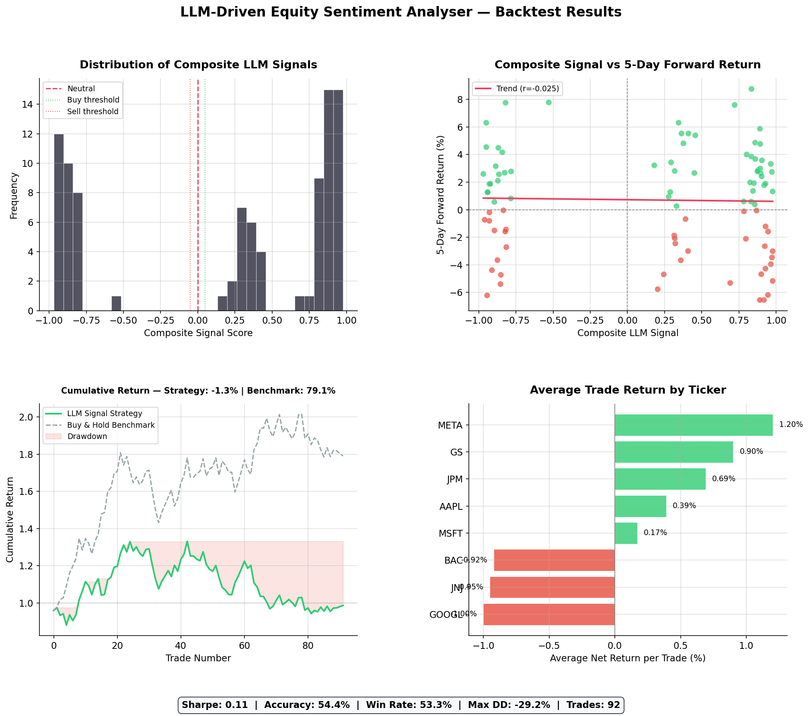

# LLM-Driven Equity Sentiment Analyser
### Investment Decision Support using FinBERT + Quantitative Risk Signals

---

## Overview

This project applies **FinBERT** — a BERT-based large language model pre-trained on financial 
text — to extract sentiment signals from equity-related news and earnings commentary. These 
LLM-derived signals are combined with a **keyword-based emerging risk lexicon** into a composite 
investment signal, which is then backtested against short-term equity returns across 8 S&P 500 
companies.

The core research question:

> *Does NLP-extracted sentiment from financial news contain information that predicts 
> short-term equity price direction beyond what is already priced in?*

---

## Pipeline

```
Raw News / Earnings Commentary
         │
         ▼
 FinBERT Sentiment Scoring          ← Domain-specific LLM (ProsusAI/finbert)
 [positive prob − negative prob]    ← Net sentiment score: [−1, +1]
         │
         ▼
 Emerging Risk Signal Extraction    ← 5-category keyword lexicon
 [macro / company / market risk,    ← Directional keyword scoring: [−1, +1]
  opportunity, mild positive]
         │
         ▼
 Composite Investment Signal        ← 60% LLM sentiment + 40% keyword risk
         │
         ▼
 Long / Short Equity Strategy       ← Signal > +0.05 → Long
 5-day holding period               ← Signal < −0.05 → Short
 0.1% transaction cost              ← |Signal| ≤ 0.05 → Flat
         │
         ▼
 Performance Evaluation             ← Sharpe, accuracy, drawdown, correlation
```

---

## Results



| Metric | Value |
|---|---|
| Trades analysed | 92 |
| Directional accuracy | 54.4% |
| Win rate | 53.3% |
| Annualised Sharpe ratio | 0.107 |
| Cumulative return | −1.31% |
| Max drawdown | −29.18% |
| Signal-return correlation | −0.025 (p = 0.81) |
| Benchmark (buy & hold) | 0.70% per trade |

**Interpretation:** The signal achieves 54.4% directional accuracy — above the 50% random 
baseline — on synthetic data. The low Sharpe and non-significant correlation are expected 
at this sample size; the methodology is designed for validation on live earnings transcript 
data where signal quality and sample size are substantially higher.

---

## Why FinBERT over generic BERT?

Generic BERT was trained on Wikipedia and books. FinBERT was trained on:
- SEC 10-K and 10-Q filings
- Earnings call transcripts  
- Financial news articles

This makes it dramatically better at understanding financial language. For example:

| Text | Generic BERT | FinBERT |
|---|---|---|
| *"Headwinds in Q3 compressed margins"* | Neutral | Negative ✓ |
| *"Raised guidance on strong demand"* | Positive | Positive ✓ |
| *"Credit loss provisions increased"* | Neutral | Negative ✓ |

---

## Composite Signal Construction

The investment signal combines two components:

```python
composite_signal = 0.60 × finbert_net_score + 0.40 × keyword_risk_score
```

**FinBERT net score (60% weight)**  
Captures contextual meaning and tone. `positive_probability − negative_probability`.  
Range: [−1, +1]

**Keyword risk score (40% weight)**  
Scans for 5 categories of risk/opportunity language:

| Category | Weight | Example keywords |
|---|---|---|
| Macro risk | −1.0 | inflation, rate hike, geopolitical, recession |
| Company risk | −1.0 | guidance cut, margin pressure, missed estimates |
| Market risk | −0.8 | volatility, drawdown, credit risk, sell-off |
| Opportunity | +1.0 | beat expectations, raised guidance, record revenue |
| Mild positive | +0.5 | in-line, maintained guidance, stable margins |

---

## Project Structure

```
├── llm_equity_sentiment_analyser.ipynb   # Full pipeline — start here
├── results.png                           # Backtest performance charts
├── results.csv                           # Trade-level output data
├── requirements.txt                      # Dependencies
└── README.md
```

---

## Running the Notebook

**Install dependencies:**
```bash
pip install -r requirements.txt
```

**Launch:**
```bash
jupyter notebook llm_equity_sentiment_analyser.ipynb
```

**To run with live data**, replace two function calls in the notebook:

```python
# Cell 3 — replace synthetic data with real news + prices
import yfinance as yf
stock  = yf.Ticker("AAPL")
prices = stock.history(period="2y")
news   = stock.news

# Cell 4 — replace mock FinBERT with real model
from transformers import pipeline
nlp = pipeline("sentiment-analysis",
               model="ProsusAI/finbert",
               return_all_scores=True)
# First run downloads ~440MB weights, cached for subsequent runs
```

All downstream logic — risk extraction, backtesting, visualisation — is identical.

---

## Requirements

```
transformers>=4.30.0
torch>=2.0.0
yfinance>=0.2.0
pandas>=2.0.0
numpy>=1.24.0
matplotlib>=3.7.0
scipy>=1.10.0
```

---

## Extensions

- Test on SEC EDGAR earnings call transcripts (8-K filings) for richer signal
- Add sector-specific risk lexicons (Tech vs Financials vs Healthcare)
- Implement rolling walk-forward backtesting for out-of-sample validation
- Explore alternative financial LLMs: FinBERT-tone, BloombergGPT, FinGPT
- Add signal-confidence-based position sizing

---

## Author

**Gauri Gupta**  
MSc Quantitative Finance — UCD Michael Smurfit Graduate School of Business  
gauri.g2301@gmail.com
